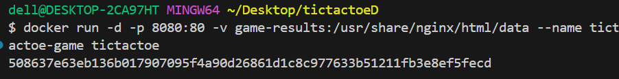

Configurer un projet Docker pour une application web.
● Vous êtes chargé d’héberger un petit jeu web, Tic Tac Toe
(Morpion), en utilisant Docker.
● Créer les fichiers fournis en annexes à la fin du document
○ Index.html
○ save.php
○ results.json

● Créer le fichier Dockerfile et le rédiger.

● Construire une image Docker pour servir les fichiers du jeu.

● Créer un volume nommé “game-results” pour stocker les
résultats dans un fichier resuslts.json et le fichier save.php
(C’est Dockerfile qui les copiera dedans)

● Exécuter le conteneur pour rendre le jeu accessible via un
navigateur sur le port 8080 .
● Envoyer les résultats disponibles dans le volume et dans
results.json
● Utilisez une image Docker basée sur Nginx pour servir les
fichiers.

● Le fichier index.html doit être copié dans le conteneur.

exposer le port 80
● accessible sur le port 8080
● Trouver la commande Docker qui permet de vérifier que la
création du volume est
<docker volume ls>
● faire en sorte que le volume soit lié au container et vérifier
que les résultats s’enregistre bien dans le volume dans
results.json par le biais du fichier save.php se trouvant aussi
dans le volume
● Trouver la commande qui affiche le contenu du container
<docker exec tictactoe-game ls -la /var/www/html>

● Trouver la commande qui affiche le contenu du volume
<docker exec tictactoe-game ls -la /var/www/html/data>

● Trouver comment faire ces deux actions dans
docker-desktop et le terminal
● Afficher le contenu de results.json avec une commande et
avec docker-desktop et dans le terminal
● Jouer au morpion pendant plusieurs parties pour générer des
résultats

● Les résultat seront visible dans un fichier results dans le
volume

● stopper le container
Afficher dans le readme une capture du résultat des parties
du jeu (contenu du fichier “result.json”)
